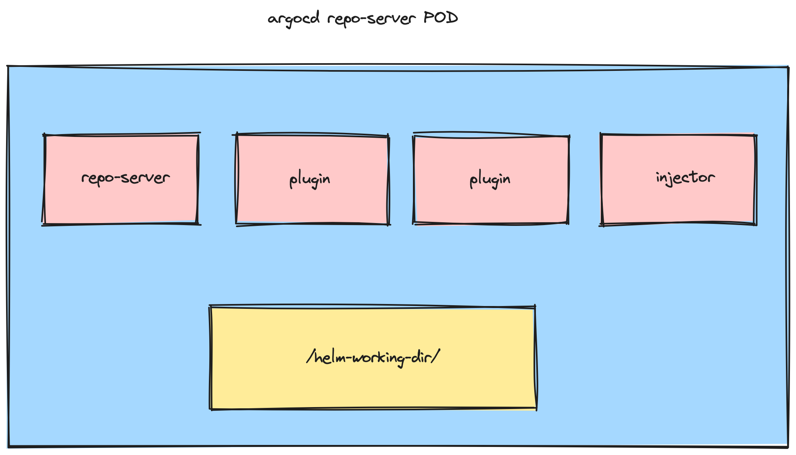

# CodeNow Argo Sidecar Helm Injector

watching `argocd.argoproj.io/secret-type=repository` labeled secrets and call `helm repo add`. Since `helm-working-dir` is shared directory between all ArgoCD plugin sidecars the newly added repository is available everywhere 





## Deployment / Configuration

this is example of container definition in k8s deployment:  

```
containers:
  - name: sidecar-helm-injector
    env:
    - name: MY_POD_NAMESPACE
      valueFrom:
        fieldRef:
          apiVersion: v1
          fieldPath: metadata.namespace
    - name: HELM_CACHE_HOME
      value: /helm-working-dir
    - name: HELM_CONFIG_HOME
      value: /helm-working-dir
    - name: HELM_DATA_HOME
      value: /helm-working-dir
    image: codenow-codenow-data-plane-proxy-docker.jfrog.io/argo-sidecar-helm-injector:<version>
    imagePullPolicy: Always
    resources:
      limits:
        cpu: 100m
        memory: 100Mi
      requests:
        cpu: 50m
        memory: 30Mi
    securityContext:
      allowPrivilegeEscalation: false
      capabilities:
        drop:
        - ALL
      readOnlyRootFilesystem: true
      runAsNonRoot: true
      runAsUser: 999
    volumeMounts:
    - mountPath: /helm-working-dir
      name: helm-working-dir
```

## Role / RoleBinding

Ensure the POD is running with service account allowing  operations:

```
rules:
- apiGroups:
  - ""
  resources:
  - secrets
  verbs:
  - get
  - list
  - watch
```